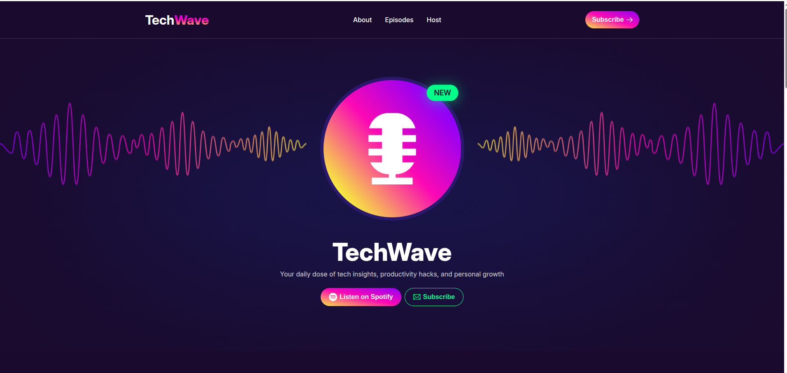
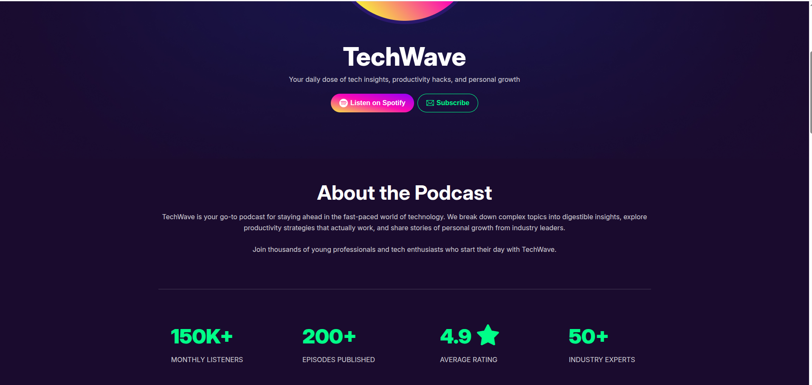
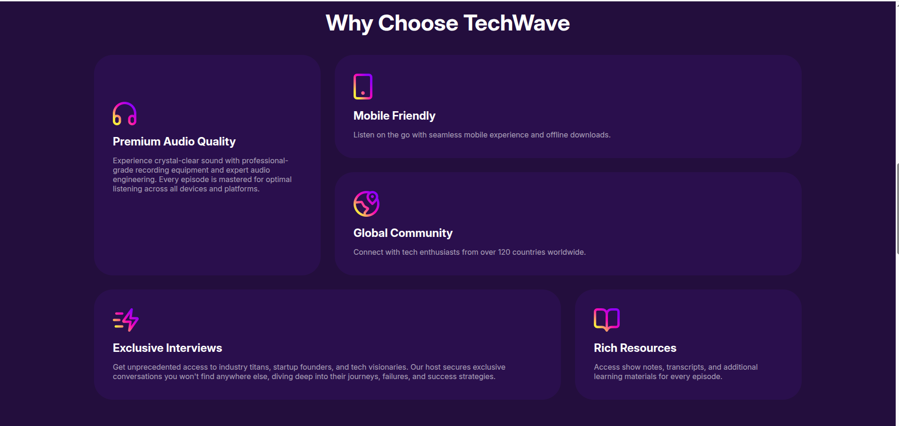
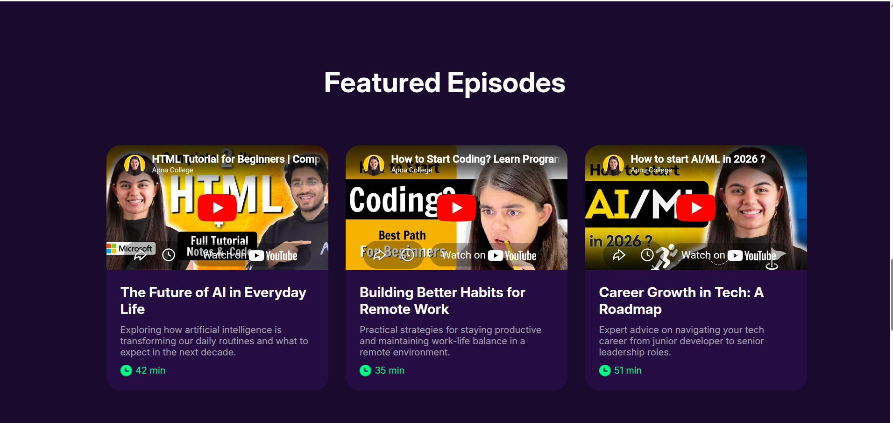
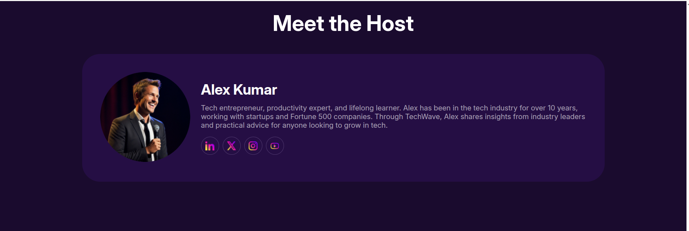

# 🎙️ TechWave Podcast Website

A **modern, responsive podcast landing page** built with **HTML5, CSS3, Flexbox/Grid**, and **Font Awesome icons**.

---

## 🌐 Live Demo

👉 [🔗 Visit Live Website](https://kouser-ahamed.github.io/B13-A02-TechWave_Kouser/)

---

## 📸 Project Demo

  
  
  
  
  

> Make sure the `assets/TechWaveDemoPic/` folder exists for correct display.

---

## 🛠️ Technologies Used

- ⚡ **HTML5** – Semantic markup for structure  
- 🎨 **CSS3** – Styling & responsive layouts  
- 🧩 **Flexbox & Grid** – Flexible & responsive design  
- 🎵 **Font Awesome Icons** – CDN icon set for UI  
- 🔤 **Google Fonts – Inter** – Clean typography  

---

## ✨ Key Features

- 🎯 Hero section with **featured podcast illustration**  
- 🎧 **Spotify & Subscribe buttons** for direct CTA  
- 📊 Podcast statistics & **about section**  
- 📝 **Why Choose TechWave** information grid  
- ▶️ Featured YouTube episode embeds  
- 🧑‍💼 Host introduction with social links  
- 📱 Fully **responsive footer** with platform icons  

---

## 📂 Project Structure

```

TechWave/
├── assets/
│   ├── TechWaveDemoPic/
│   │   ├── tech-1.png
│   │   ├── tech-2.png
│   │   ├── tech-3.png
│   │   ├── tech-4.png
│   │   └── tech-5.png
│   ├── microphone.png
│   ├── spotify.png
│   └── ...other icons & images
├── styles/
│   └── styles.css
├── index.html
└── README.md

````

> Maintain folder structure for proper asset linking.

---

## 💻 Local Setup

1. **Clone the repo:**

```bash
git clone https://github.com/kouser-ahamed/B13-A02-TechWave_Kouser.git
````

2. **Navigate to project folder:**

```bash
cd B13-A02-TechWave_Kouser
```

3. **Open in browser:**
   Double-click `index.html` or use **Live Server** in VSCode.

---

## 🎓 Learning Outcomes

* ✅ **Responsive Layouts** with Flexbox & Grid
* ✅ **Semantic HTML** structure for clarity
* ✅ **External CDN Integration** (Font Awesome, Google Fonts)
* ✅ **YouTube Video Embeds** inside cards
* ✅ **Clean, modern UI** for podcasts

---

## 🚀 Future Improvements

* 🌙 Add **dark mode toggle**
* 🎵 **Audio player** for podcast streaming
* 🛠️ Backend integration for dynamic episodes
* 🔍 Episode search & filtering
* ✨ Subtle scroll & hover animations

---

## 🔗 Useful Links

* 🌐 **Live Demo:** [https://kouser-ahamed.github.io/B13-A02-TechWave_Kouser/](https://kouser-ahamed.github.io/B13-A02-TechWave_Kouser/)
* 💻 **GitHub Repo:** [https://github.com/kouser-ahamed/B13-A02-TechWave_Kouser](https://github.com/kouser-ahamed/B13-A02-TechWave_Kouser)

---

